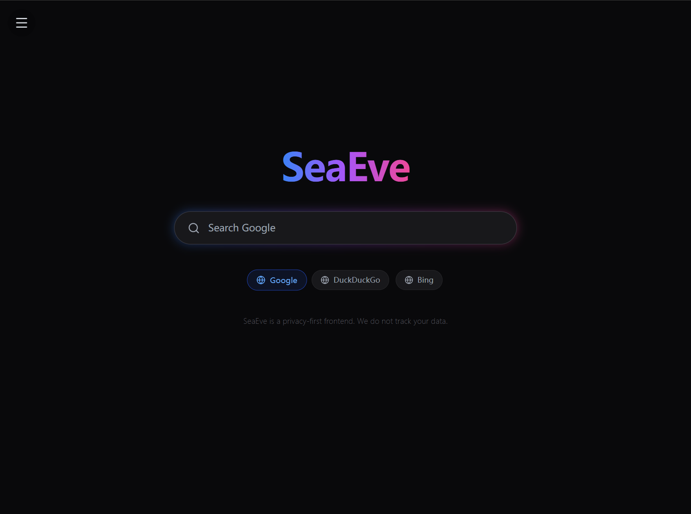

\# 🌊 SeaEve


<p align="center">

&nbsp; <strong>The best search engine in the world.</strong><br/>

&nbsp; A modern, fast, and elegant search engine web application

</p>


<p align="center">

&nbsp; <a href="#-english">English</a> · <a href="#-中文">中文</a>

</p>


<p align="center">

&nbsp; 

</p>


---


\## 🇺🇸 English


\## ✨ Product Overview


\*\*SeaEve\*\* is a \*\*product-oriented search engine frontend\*\* built with  

\*\*React + TypeScript + Vite\*\*, designed to deliver a \*\*clean UI, fast performance,

and a polished user experience\*\*.


It focuses on being \*\*simple to use\*\*, \*\*easy to extend\*\*, and \*\*production-ready\*\*.


\### Ideal for


\- 🔍 Search engine frontend products

\- 🚀 Startup or indie product demos

\- 🧪 Rapid prototyping \& UX validation

\- 📚 High-quality React + TypeScript reference


---


\## 🖼️ UI Showcase


\### Home \& Search Experience (Side-by-Side)


<table>

&nbsp; <tr>

&nbsp;   <td width="50%">

&nbsp;     

&nbsp;     <p align="center"><strong>Home Page</strong></p>

&nbsp;   </td>

&nbsp;   <td width="50%">

&nbsp;     

&nbsp;     <p align="center"><strong>Search Results</strong></p>

&nbsp;   </td>

&nbsp; </tr>

</table>


\### More Screens


<table>

&nbsp; <tr>

&nbsp;   <td width="33%">

&nbsp;     

&nbsp;   </td>

&nbsp;   <td width="33%">

&nbsp;     

&nbsp;   </td>

&nbsp;   <td width="33%">

&nbsp;     

&nbsp;   </td>

&nbsp; </tr>

</table>


---


\## 🚀 Key Features


\- ⚡ \*\*Blazing-fast performance\*\* — Powered by Vite

\- 🎯 \*\*Search-first UX design\*\* — Clean, distraction-free interface

\- 🧩 \*\*Scalable architecture\*\* — Component-based \& hook-driven

\- 🛠️ \*\*Type-safe codebase\*\* — Built with TypeScript

\- 🎨 \*\*Product-level UI\*\* — Ready for real-world usage


---


\## 🧱 Tech Stack


| Technology | Description |

|---|---|

| React | UI framework |

| TypeScript | Static typing |

| Vite | Build \& dev tool |

| HTML / CSS | Layout \& styling |

| Hooks | Logic abstraction |


---


\## 📁 Project Structure


```text

SeaEve/

├─ components/        # Reusable UI components

├─ hooks/             # Custom React hooks

├─ App.tsx            # Main application

├─ index.tsx          # Entry point

├─ index.html         # HTML template

├─ types.ts           # Global types

├─ metadata.json      # App metadata

├─ vite.config.ts     # Vite config

├─ tsconfig.json      # TypeScript config

├─ package.json       # Scripts \& deps

└─ README.md


